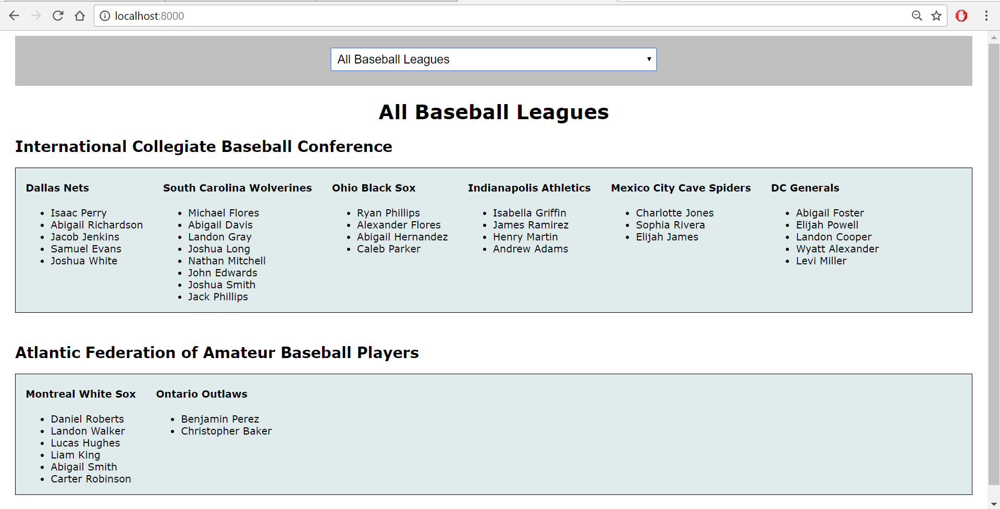
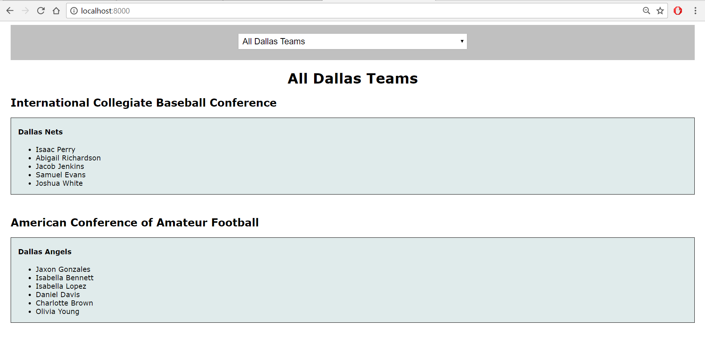
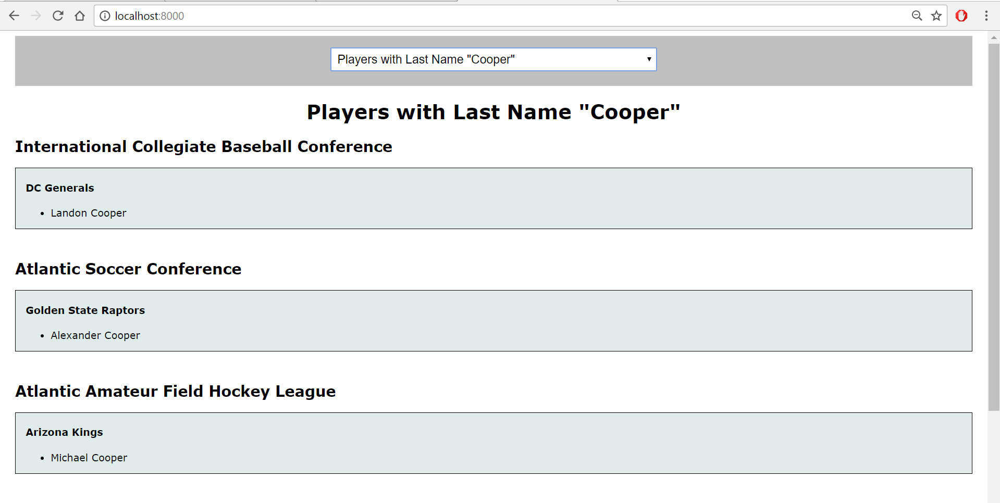

## Initial Setup
Clone this repo for the CodingDojo Sports ORM assignments in the Django Level 2 curriculum.

`git clone https://github.com/madjaqk/sports_orm.git`

When you `python manage.py runserver` and naviate to localhost:8000, you should see a list of leagues, teams, and players.  Modify `apps/leagues/views.py` and/or `apps/leagues/templates/leagues/index.html` to change the displayed list.

### Questions

We are asked to retrieve the results of [these](level_1.md) searches (view the linked doc for expected output).

## My edits
I edited the code to categorize the players by team and league, as in the following screenshots. Note that even when the filter only selects a few teams or players, the categorization remains.

### Filter based on league

### Filter based on team

### Filter based on player

